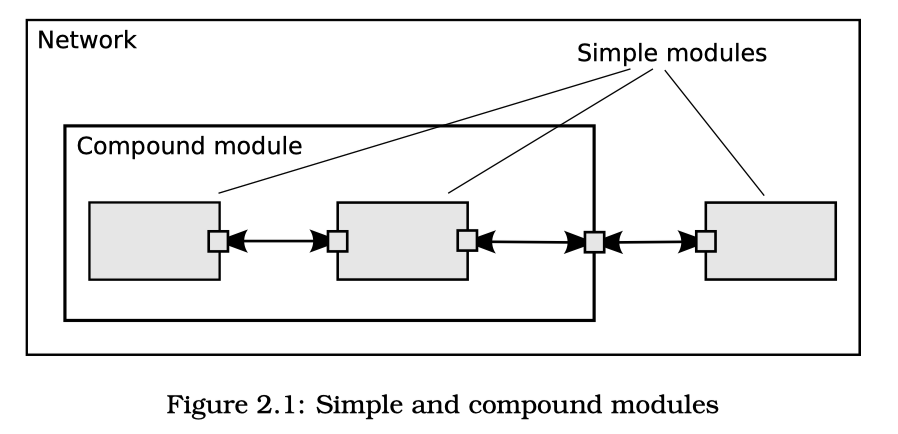

# Omnetpp 

## Omnetpp 

**Models** assembled from reusable **modules**. 

**Modules** connect with each other via **gates**. **Modules** at lowest level are **Simple** **modules** and they encapsulate model behavior. They are programming in C++ and use simulation library. 

**Models** = **Modules** + Communication {**gates**, **connections**, **messages**}.

## Omnetpp (Tictoc) project consists of components: 
- Network Description File (NED)
  - module type ***simple*** "Txc1"-- atomic on NED level 
  - module type ***network*** "TicToc1"
- C++ file
  - Implement the functionality of the *simple module* "Txc1"
     - class Txc1 : public cSimpleModule{ methods }

    `Messages (packets, frames, jobs, etc) and events (timers, timeouts) are all represented by cMessage objects (or its subclasses) in OMNeT++. After you send or schedule them, they will be held by the simulation kernel in the "scheduled events" or "future events" list.`

Modules support inheritance. 

## Wildcards
Note that because omnetpp.ini supports wildcards, and parameters assigned from NED files take precedence over the ones in omnetpp.ini. 

#### Same effect:

Tictoc4.t*c.limit=5

or

Tictoc4.*.limit=5

or even

**.limit=5

(The difference between * and ** is that * will not match a dot and ** will.)